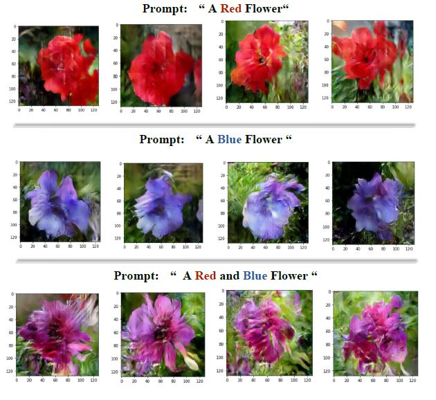
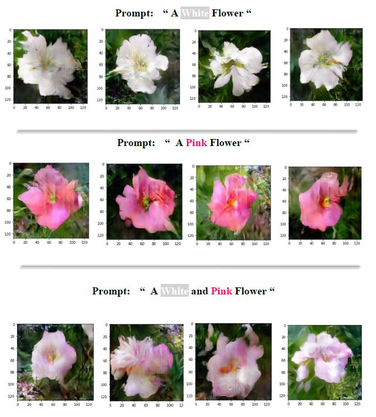
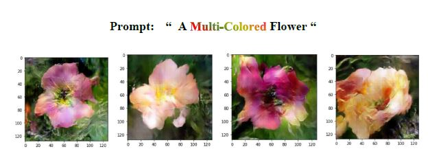
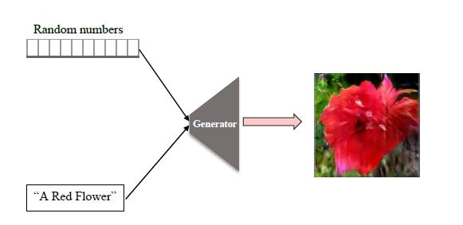
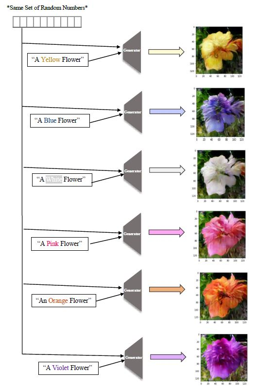

# Image-Synthesis-Flowers

In this project I used Generative Adversarial Neural-Networks to synthesize images of flowers.

## Approach
This is an implementation of a basic GAN. I implemented a discriminator (Binary Classifier) and a Generator (creates images from a random vector).
And then trained both networks simultaneously, By training the discriminator to diffrentiate real images from the fake ones, and updated the generator based on the discriminators feedback.

I created my GAN and trained it from scratch with the help of Keras API.

## Dataset
The training set is Oxfords flowers dataset.

## Text-To-Image (Additional Section)
Additinally, I implemented a Conditional Generative Adversarial Neural Network (CGAN), using Language Models & Convolutional Neural Networks. 

Then trained the model on the same images dataset but with a text discribtion. Below are some of the results and my experiments with it. 
I’ll show how it extracts semantics from text to create fake images of flowers. The model interprets single colors, as well as combinations of colors to synthesize images of flowers.

#The model works by combining a vector of randomly generated numbers (latent victor) with a text input to generate a unique image :

This means that multiple versions of a single image can be generate, by using the same latent victor but with different text inputs. Below is a demonstration:

