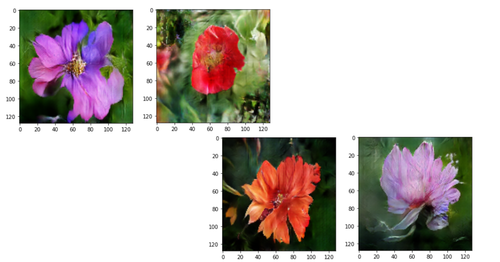

# Image-Synthesis-Flowers
Using GANs to synthesize beautiful images of flowers.

In this project I used Generative Adversarial Neural-Networks to synthesize images of flowers.

## Approach
This is an implementation of a basic GAN. I implemented a discriminator (Binary Classifier) and a Generator (creates images from a random vector).
And then trained both networks simultaneously, By training the discriminator to diffrentiate real images from the fake ones, and updated the generator based on the discriminators feedback.

I created my GAN and trained it from scratch with the help of Keras API.

## Dataset
The training set is Oxfords flowers dataset.

